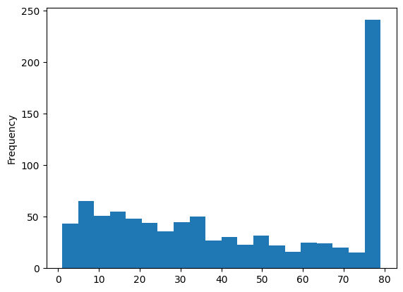

```python
import pandas as pd
import numpy as np
import matplotlib.pyplot as plt

from typing import Tuple

from utils.fixing_data import reduce_sector_cardinality
```

### Working on quarterly data


```python
merged_data_quarterly = pd.read_feather("./data/merged_data_quarterly.feather")
```

#### Creation of the target: 1year price, shifting the price column 4 quarters


```python
merged_data_quarterly['1year_price'] = merged_data_quarterly.groupby('asset_num')['prices_avg'].shift(-4)
```

There are few assets, excepting the last 4 quarters where obviously we don't have the target, that have null price.


```python
merged_data_quarterly['1year_price']
```


    0         1.891625
    1        18.949231
    2        34.950000
    3        25.590000
    4        38.520000
               ...    
    74097          NaN
    74098          NaN
    74099          NaN
    74100          NaN
    74101          NaN
    Name: 1year_price, Length: 74102, dtype: float64


```python
merged_data_quarterly.head()
```


<div>
<style scoped>
    .dataframe tbody tr th:only-of-type {
        vertical-align: middle;
    }

    .dataframe tbody tr th {
        vertical-align: top;
    }

    .dataframe thead th {
        text-align: right;
    }
</style>
<table border="1" class="dataframe">
  <thead>
    <tr style="text-align: right;">
      <th></th>
      <th>quarter</th>
      <th>asset_num</th>
      <th>prices_avg</th>
      <th>prices_std</th>
      <th>cap_ex</th>
      <th>cash</th>
      <th>dil_shares</th>
      <th>ebit</th>
      <th>ebitda</th>
      <th>net_inc</th>
      <th>survivor</th>
      <th>T_assets</th>
      <th>T_debt</th>
      <th>T_rev</th>
      <th>sector</th>
      <th>1year_price</th>
    </tr>
  </thead>
  <tbody>
    <tr>
      <th>0</th>
      <td>2005Q1</td>
      <td>12861</td>
      <td>1.256760</td>
      <td>0.118452</td>
      <td>-190.000</td>
      <td>2475.000</td>
      <td>22880.814320</td>
      <td>678.000</td>
      <td>825.300</td>
      <td>508.000</td>
      <td>True</td>
      <td>9362.000</td>
      <td>0.000</td>
      <td>9763.000</td>
      <td>Technology Hardware, Storage &amp; Peripherals</td>
      <td>1.891625</td>
    </tr>
    <tr>
      <th>1</th>
      <td>2005Q1</td>
      <td>12883</td>
      <td>15.538408</td>
      <td>0.570329</td>
      <td>-2.231</td>
      <td>58.367</td>
      <td>90.187000</td>
      <td>259.082</td>
      <td>260.558</td>
      <td>281.445</td>
      <td>False</td>
      <td>3491.427</td>
      <td>1578.374</td>
      <td>336.082</td>
      <td>Asset Management &amp; Custody Banks</td>
      <td>18.949231</td>
    </tr>
    <tr>
      <th>2</th>
      <td>2005Q1</td>
      <td>12911</td>
      <td>33.585000</td>
      <td>1.734762</td>
      <td>-60.294</td>
      <td>336.525</td>
      <td>488.400994</td>
      <td>599.244</td>
      <td>661.568</td>
      <td>479.257</td>
      <td>True</td>
      <td>2122.810</td>
      <td>0.000</td>
      <td>1716.182</td>
      <td>Application Software</td>
      <td>34.950000</td>
    </tr>
    <tr>
      <th>3</th>
      <td>2005Q1</td>
      <td>12913</td>
      <td>13.929720</td>
      <td>1.205714</td>
      <td>-12.000</td>
      <td>88.400</td>
      <td>810.770999</td>
      <td>35.500</td>
      <td>81.200</td>
      <td>71.300</td>
      <td>True</td>
      <td>1432.900</td>
      <td>400.000</td>
      <td>891.000</td>
      <td>Technology Hardware &amp; Equipment</td>
      <td>25.590000</td>
    </tr>
    <tr>
      <th>4</th>
      <td>2005Q1</td>
      <td>12924</td>
      <td>29.760000</td>
      <td>1.916605</td>
      <td>-40.835</td>
      <td>517.654</td>
      <td>228.000000</td>
      <td>261.573</td>
      <td>313.522</td>
      <td>221.508</td>
      <td>True</td>
      <td>1142.204</td>
      <td>0.000</td>
      <td>1233.767</td>
      <td>Application Software</td>
      <td>38.520000</td>
    </tr>
  </tbody>
</table>
</div>


```python
merged_data_quarterly.isna().sum()
```


    quarter            0
    asset_num          0
    prices_avg     18203
    prices_std     18219
    cap_ex         20736
    cash           17199
    dil_shares     17096
    ebit           20322
    ebitda         20592
    net_inc        17082
    survivor           0
    T_assets       17078
    T_debt         17082
    T_rev          17087
    sector             0
    1year_price    21288
    dtype: int64


#### Creating survivor dataset in order to get only the assets that were on the SP500


```python
df_survivor = merged_data_quarterly[merged_data_quarterly['survivor']==1].reset_index(drop=True)
df_survivor.head()
```


<div>
<style scoped>
    .dataframe tbody tr th:only-of-type {
        vertical-align: middle;
    }

    .dataframe tbody tr th {
        vertical-align: top;
    }

    .dataframe thead th {
        text-align: right;
    }
</style>
<table border="1" class="dataframe">
  <thead>
    <tr style="text-align: right;">
      <th></th>
      <th>quarter</th>
      <th>asset_num</th>
      <th>prices_avg</th>
      <th>prices_std</th>
      <th>cap_ex</th>
      <th>cash</th>
      <th>dil_shares</th>
      <th>ebit</th>
      <th>ebitda</th>
      <th>net_inc</th>
      <th>survivor</th>
      <th>T_assets</th>
      <th>T_debt</th>
      <th>T_rev</th>
      <th>sector</th>
      <th>1year_price</th>
    </tr>
  </thead>
  <tbody>
    <tr>
      <th>0</th>
      <td>2005Q1</td>
      <td>12861</td>
      <td>1.256760</td>
      <td>0.118452</td>
      <td>-190.000</td>
      <td>2475.000</td>
      <td>22880.814320</td>
      <td>678.000</td>
      <td>825.300</td>
      <td>508.000</td>
      <td>True</td>
      <td>9362.000</td>
      <td>0.0</td>
      <td>9763.000</td>
      <td>Technology Hardware, Storage &amp; Peripherals</td>
      <td>1.891625</td>
    </tr>
    <tr>
      <th>1</th>
      <td>2005Q1</td>
      <td>12911</td>
      <td>33.585000</td>
      <td>1.734762</td>
      <td>-60.294</td>
      <td>336.525</td>
      <td>488.400994</td>
      <td>599.244</td>
      <td>661.568</td>
      <td>479.257</td>
      <td>True</td>
      <td>2122.810</td>
      <td>0.0</td>
      <td>1716.182</td>
      <td>Application Software</td>
      <td>34.950000</td>
    </tr>
    <tr>
      <th>2</th>
      <td>2005Q1</td>
      <td>12913</td>
      <td>13.929720</td>
      <td>1.205714</td>
      <td>-12.000</td>
      <td>88.400</td>
      <td>810.770999</td>
      <td>35.500</td>
      <td>81.200</td>
      <td>71.300</td>
      <td>True</td>
      <td>1432.900</td>
      <td>400.0</td>
      <td>891.000</td>
      <td>Technology Hardware &amp; Equipment</td>
      <td>25.590000</td>
    </tr>
    <tr>
      <th>3</th>
      <td>2005Q1</td>
      <td>12924</td>
      <td>29.760000</td>
      <td>1.916605</td>
      <td>-40.835</td>
      <td>517.654</td>
      <td>228.000000</td>
      <td>261.573</td>
      <td>313.522</td>
      <td>221.508</td>
      <td>True</td>
      <td>1142.204</td>
      <td>0.0</td>
      <td>1233.767</td>
      <td>Application Software</td>
      <td>38.520000</td>
    </tr>
    <tr>
      <th>4</th>
      <td>2005Q1</td>
      <td>12995</td>
      <td>17.846608</td>
      <td>0.854719</td>
      <td>-24.693</td>
      <td>579.936</td>
      <td>372.299000</td>
      <td>314.926</td>
      <td>345.405</td>
      <td>275.111</td>
      <td>True</td>
      <td>1746.666</td>
      <td>0.0</td>
      <td>1016.364</td>
      <td>Semiconductors</td>
      <td>18.622548</td>
    </tr>
  </tbody>
</table>
</div>


```python
df_survivor.isna().sum()
```


    quarter           0
    asset_num         0
    prices_avg       26
    prices_std       26
    cap_ex         2750
    cash            461
    dil_shares      318
    ebit           2943
    ebitda         3007
    net_inc         417
    survivor          0
    T_assets        426
    T_debt          428
    T_rev           417
    sector            0
    1year_price    2692
    dtype: int64


```python
df_survivor[df_survivor['prices_avg'].isna()]['asset_num'].value_counts().reset_index()
```


<div>
<style scoped>
    .dataframe tbody tr th:only-of-type {
        vertical-align: middle;
    }

    .dataframe tbody tr th {
        vertical-align: top;
    }

    .dataframe thead th {
        text-align: right;
    }
</style>
<table border="1" class="dataframe">
  <thead>
    <tr style="text-align: right;">
      <th></th>
      <th>asset_num</th>
      <th>count</th>
    </tr>
  </thead>
  <tbody>
    <tr>
      <th>0</th>
      <td>741543</td>
      <td>14</td>
    </tr>
    <tr>
      <th>1</th>
      <td>64740</td>
      <td>10</td>
    </tr>
    <tr>
      <th>2</th>
      <td>94833</td>
      <td>2</td>
    </tr>
  </tbody>
</table>
</div>


After analyzing these 3 assets, we can see a strange pattern in them and the data is not reliable. We will remove them from the dataset.


```python
na_assets = df_survivor[df_survivor['prices_avg'].isna()]['asset_num'].unique()
na_assets
```


    array([ 64740,  94833, 741543])


```python
df_survivor = df_survivor[~df_survivor['asset_num'].isin(na_assets)]
```


```python
### Number of assets before transformations
merged_data_quarterly['asset_num'].nunique()
```


    938


```python
### Number of assets after transformations
df_survivor['asset_num'].nunique()
```


    912


```python
assets_x_quarter = df_survivor.groupby('quarter')['asset_num'].nunique().reset_index()['asset_num'].value_counts().reset_index()
assets_x_quarter
```


<div>
<style scoped>
    .dataframe tbody tr th:only-of-type {
        vertical-align: middle;
    }

    .dataframe tbody tr th {
        vertical-align: top;
    }

    .dataframe thead th {
        text-align: right;
    }
</style>
<table border="1" class="dataframe">
  <thead>
    <tr style="text-align: right;">
      <th></th>
      <th>asset_num</th>
      <th>count</th>
    </tr>
  </thead>
  <tbody>
    <tr>
      <th>0</th>
      <td>498</td>
      <td>36</td>
    </tr>
    <tr>
      <th>1</th>
      <td>500</td>
      <td>20</td>
    </tr>
    <tr>
      <th>2</th>
      <td>499</td>
      <td>13</td>
    </tr>
    <tr>
      <th>3</th>
      <td>497</td>
      <td>7</td>
    </tr>
    <tr>
      <th>4</th>
      <td>496</td>
      <td>3</td>
    </tr>
  </tbody>
</table>
</div>


### Reducing the cardinality of sector column


```python
df_survivor = reduce_sector_cardinality(df_survivor)
```


```python
df_survivor['new_sector'].value_counts()
```


    new_sector
    Financials                5821
    Industrials               5305
    Consumer Discretionary    4854
    Information Technology    4663
    Health Care               4612
    Consumer Staples          3087
    Energy                    2664
    Utilities                 2373
    Materials                 2259
    Communication Services    1901
    Real Estate               1843
    Name: count, dtype: int64


```python
# Percentage of missing values per column by quarter
df_survivor.groupby('quarter').apply(
    lambda group: group.isnull().mean(),include_groups=False)
```


<div>
<style scoped>
    .dataframe tbody tr th:only-of-type {
        vertical-align: middle;
    }

    .dataframe tbody tr th {
        vertical-align: top;
    }

    .dataframe thead th {
        text-align: right;
    }
</style>
<table border="1" class="dataframe">
  <thead>
    <tr style="text-align: right;">
      <th></th>
      <th>asset_num</th>
      <th>prices_avg</th>
      <th>prices_std</th>
      <th>cap_ex</th>
      <th>cash</th>
      <th>dil_shares</th>
      <th>ebit</th>
      <th>ebitda</th>
      <th>net_inc</th>
      <th>survivor</th>
      <th>T_assets</th>
      <th>T_debt</th>
      <th>T_rev</th>
      <th>sector</th>
      <th>1year_price</th>
      <th>new_sector</th>
    </tr>
    <tr>
      <th>quarter</th>
      <th></th>
      <th></th>
      <th></th>
      <th></th>
      <th></th>
      <th></th>
      <th></th>
      <th></th>
      <th></th>
      <th></th>
      <th></th>
      <th></th>
      <th></th>
      <th></th>
      <th></th>
      <th></th>
    </tr>
  </thead>
  <tbody>
    <tr>
      <th>2005Q1</th>
      <td>0.0</td>
      <td>0.0</td>
      <td>0.0</td>
      <td>0.080321</td>
      <td>0.030120</td>
      <td>0.020080</td>
      <td>0.104418</td>
      <td>0.106426</td>
      <td>0.018072</td>
      <td>0.0</td>
      <td>0.030120</td>
      <td>0.030120</td>
      <td>0.018072</td>
      <td>0.0</td>
      <td>0.024096</td>
      <td>0.0</td>
    </tr>
    <tr>
      <th>2005Q2</th>
      <td>0.0</td>
      <td>0.0</td>
      <td>0.0</td>
      <td>0.058233</td>
      <td>0.018072</td>
      <td>0.020080</td>
      <td>0.106426</td>
      <td>0.110442</td>
      <td>0.018072</td>
      <td>0.0</td>
      <td>0.018072</td>
      <td>0.018072</td>
      <td>0.018072</td>
      <td>0.0</td>
      <td>0.038153</td>
      <td>0.0</td>
    </tr>
    <tr>
      <th>2005Q3</th>
      <td>0.0</td>
      <td>0.0</td>
      <td>0.0</td>
      <td>0.060120</td>
      <td>0.020040</td>
      <td>0.020040</td>
      <td>0.104208</td>
      <td>0.106212</td>
      <td>0.016032</td>
      <td>0.0</td>
      <td>0.018036</td>
      <td>0.018036</td>
      <td>0.016032</td>
      <td>0.0</td>
      <td>0.034068</td>
      <td>0.0</td>
    </tr>
    <tr>
      <th>2005Q4</th>
      <td>0.0</td>
      <td>0.0</td>
      <td>0.0</td>
      <td>0.060120</td>
      <td>0.020040</td>
      <td>0.018036</td>
      <td>0.104208</td>
      <td>0.108216</td>
      <td>0.020040</td>
      <td>0.0</td>
      <td>0.020040</td>
      <td>0.020040</td>
      <td>0.020040</td>
      <td>0.0</td>
      <td>0.030060</td>
      <td>0.0</td>
    </tr>
    <tr>
      <th>2006Q1</th>
      <td>0.0</td>
      <td>0.0</td>
      <td>0.0</td>
      <td>0.066132</td>
      <td>0.018036</td>
      <td>0.018036</td>
      <td>0.100200</td>
      <td>0.102204</td>
      <td>0.018036</td>
      <td>0.0</td>
      <td>0.018036</td>
      <td>0.018036</td>
      <td>0.018036</td>
      <td>0.0</td>
      <td>0.036072</td>
      <td>0.0</td>
    </tr>
    <tr>
      <th>...</th>
      <td>...</td>
      <td>...</td>
      <td>...</td>
      <td>...</td>
      <td>...</td>
      <td>...</td>
      <td>...</td>
      <td>...</td>
      <td>...</td>
      <td>...</td>
      <td>...</td>
      <td>...</td>
      <td>...</td>
      <td>...</td>
      <td>...</td>
      <td>...</td>
    </tr>
    <tr>
      <th>2023Q3</th>
      <td>0.0</td>
      <td>0.0</td>
      <td>0.0</td>
      <td>0.070281</td>
      <td>0.006024</td>
      <td>0.000000</td>
      <td>0.060241</td>
      <td>0.064257</td>
      <td>0.006024</td>
      <td>0.0</td>
      <td>0.006024</td>
      <td>0.006024</td>
      <td>0.006024</td>
      <td>0.0</td>
      <td>0.004016</td>
      <td>0.0</td>
    </tr>
    <tr>
      <th>2023Q4</th>
      <td>0.0</td>
      <td>0.0</td>
      <td>0.0</td>
      <td>0.068273</td>
      <td>0.000000</td>
      <td>0.000000</td>
      <td>0.054217</td>
      <td>0.058233</td>
      <td>0.000000</td>
      <td>0.0</td>
      <td>0.000000</td>
      <td>0.002008</td>
      <td>0.000000</td>
      <td>0.0</td>
      <td>1.000000</td>
      <td>0.0</td>
    </tr>
    <tr>
      <th>2024Q1</th>
      <td>0.0</td>
      <td>0.0</td>
      <td>0.0</td>
      <td>0.070281</td>
      <td>0.002008</td>
      <td>0.000000</td>
      <td>0.056225</td>
      <td>0.058233</td>
      <td>0.002008</td>
      <td>0.0</td>
      <td>0.002008</td>
      <td>0.002008</td>
      <td>0.002008</td>
      <td>0.0</td>
      <td>1.000000</td>
      <td>0.0</td>
    </tr>
    <tr>
      <th>2024Q2</th>
      <td>0.0</td>
      <td>0.0</td>
      <td>0.0</td>
      <td>0.066265</td>
      <td>0.000000</td>
      <td>0.000000</td>
      <td>0.052209</td>
      <td>0.058233</td>
      <td>0.000000</td>
      <td>0.0</td>
      <td>0.000000</td>
      <td>0.000000</td>
      <td>0.000000</td>
      <td>0.0</td>
      <td>1.000000</td>
      <td>0.0</td>
    </tr>
    <tr>
      <th>2024Q3</th>
      <td>0.0</td>
      <td>0.0</td>
      <td>0.0</td>
      <td>0.076305</td>
      <td>0.004016</td>
      <td>0.000000</td>
      <td>0.056225</td>
      <td>0.062249</td>
      <td>0.004016</td>
      <td>0.0</td>
      <td>0.004016</td>
      <td>0.006024</td>
      <td>0.004016</td>
      <td>0.0</td>
      <td>1.000000</td>
      <td>0.0</td>
    </tr>
  </tbody>
</table>
<p>79 rows × 16 columns</p>
</div>


After analyzing the % of missing values by quarter, we can see that there is no alarming situation, at most there is a 10% of missing values in some variables.


```python
df_survivor.groupby('asset_num').count().sort_values('quarter',ascending=False)['quarter'].plot(kind='hist',bins=20)
plt.show()
```


    

    


### Feature Engineering

#### Creating the following features:
**Ratios of features:**

EBIT Margin: EBIT / Total Revenues

EBITDA Margin: EBITDA / Total Revenues

Net Margin: Net Income / Total Revenues

Return on Assets (ROA): Net Income / Total Assets

Return on Equity (ROE): Net Income / (Total Assets - Total Debt)

Debts on Assets: Total Debt / Total Assets

Net Debt: Total Debt - Cash And Equivalent

Cash ratio: Cash And Equivalent / Total Debt

Price earning ratio : Prices / Net income per share

Enterprise value (EV): Market cap(Prices x Shares) + Total Debt - Cash and equivalents


```python
df_final = df_survivor.copy()
```


```python
df_final['ebit_marg'] = df_final['ebit'] / df_final['T_rev']
df_final['ebitda_marg'] = df_final['ebitda'] / df_final['T_rev']
df_final['net_marg'] = df_final['net_inc'] / df_final['T_rev']
df_final['ROA'] = df_final['net_inc'] / df_final['T_assets']
df_final['ROE'] = df_final['net_inc'] / (df_final['T_assets'] - df_final['T_debt'])
df_final['debts_assets'] = df_final['T_debt'] / df_final['T_assets']
df_final['net_debt'] = df_final['T_debt'] - df_final['cash']
df_final['cash_ratio'] = df_final['cash'] / df_final['T_debt']
df_final['net_income_per_share'] = df_final['net_inc'] / df_final['dil_shares']
df_final['price_earning_ratio'] = df_final['prices_avg'] / df_final['net_income_per_share']
df_final['ev'] = df_final['prices_avg'] * df_final['dil_shares'] + df_final['T_debt'] - df_final['cash']

df_final.replace([np.inf, -np.inf], np.nan, inplace=True)
```


```python
#Filtering the data excluding the last 4 quarters to see the amount of missing values   
exclude_periods = [
    pd.Period('2023Q4', freq='Q-DEC'),
    pd.Period('2024Q1', freq='Q-DEC'),
    pd.Period('2024Q2', freq='Q-DEC'),
    pd.Period('2024Q3', freq='Q-DEC'),
]

excluded_data = df_final[~df_final['quarter'].isin(exclude_periods)]
excluded_data.isna().sum()
```


    quarter                    0
    asset_num                  0
    prices_avg                 0
    prices_std                 0
    cap_ex                  2597
    cash                     445
    dil_shares               304
    ebit                    2821
    ebitda                  2876
    net_inc                  401
    survivor                   0
    T_assets                 410
    T_debt                   410
    T_rev                    401
    sector                     0
    1year_price              670
    new_sector                 0
    ebit_marg               2821
    ebitda_marg             2876
    net_marg                 401
    ROA                      419
    ROE                      419
    debts_assets             410
    net_debt                 445
    cash_ratio              1711
    net_income_per_share     598
    price_earning_ratio      599
    ev                       645
    dtype: int64


Missing values in the target are caused by two main reasons:
- Missing values in the target column are due to the fact that when a company is no longer in the SP500, usually we stop having information about it, so we can't have a target for the last 4 quarters.
- The other missing values we have at the target column appear at the last 4 quarters due to the fact that we can't have the target for them.

We will remove the rows with missing values in the target column.


```python
df_final.dropna(subset=['1year_price'], inplace=True)
```


```python
df_final.isna().sum()
```


    quarter                    0
    asset_num                  0
    prices_avg                 0
    prices_std                 0
    cap_ex                  2561
    cash                     431
    dil_shares               284
    ebit                    2741
    ebitda                  2796
    net_inc                  387
    survivor                   0
    T_assets                 396
    T_debt                   396
    T_rev                    387
    sector                     0
    1year_price                0
    new_sector                 0
    ebit_marg               2741
    ebitda_marg             2796
    net_marg                 387
    ROA                      405
    ROE                      405
    debts_assets             396
    net_debt                 431
    cash_ratio              1673
    net_income_per_share     564
    price_earning_ratio      565
    ev                       611
    dtype: int64


```python
df_final['quarter'].value_counts().value_counts()
```


    count
    492    10
    493     9
    494     8
    490     8
    491     7
    484     5
    479     4
    482     4
    486     4
    496     3
    495     3
    489     2
    481     2
    498     1
    485     1
    487     1
    488     1
    497     1
    478     1
    Name: count, dtype: int64


```python
df_final.to_feather("./data/final_data.feather")
```

### Creation of the dataset partitions to train the model


```python
info_cols = ['asset_num','quarter','sector','survivor']
target_col = '1year_price'
df_final['new_sector'] = df_final['new_sector'].astype('category')

feature_cols = [col for col in df_final.columns if col not in info_cols + [target_col]]
print(df_final[feature_cols].isna().sum())
```

    prices_avg                 0
    prices_std                 0
    cap_ex                  2561
    cash                     431
    dil_shares               284
    ebit                    2741
    ebitda                  2796
    net_inc                  387
    T_assets                 396
    T_debt                   396
    T_rev                    387
    new_sector                 0
    ebit_marg               2741
    ebitda_marg             2796
    net_marg                 387
    ROA                      405
    ROE                      405
    debts_assets             396
    net_debt                 431
    cash_ratio              1673
    net_income_per_share     564
    price_earning_ratio      565
    ev                       611
    dtype: int64
    


```python
def prepare_train_test_data(dataset: pd.DataFrame, quarters_col: str, features: list[str], target: str, window_size:int=10) -> list[Tuple[pd.DataFrame, pd.Series, pd.DataFrame, pd.Series]]:
    
    data = dataset.sort_values(by=[quarters_col, 'asset_num'])
    unique_quarters = data[quarters_col].unique()
    datasets = []

    for i in range(len(unique_quarters) - window_size):
        train_quarters = unique_quarters[i:i + window_size]
        test_quarter = unique_quarters[i + window_size]
        
        train_data = data[data[quarters_col].isin(train_quarters)]
        test_data = data[data[quarters_col] == test_quarter]

        X_train = train_data[features]
        y_train = train_data[target]
        X_test = test_data[features]
        y_test = test_data[target]
        
        datasets.append((X_train, y_train, X_test, y_test))
        
    return datasets
```


```python
window_size = 10
datasets = prepare_train_test_data(df_final, 'quarter', feature_cols, target_col, window_size=window_size)
```


```python
unique_quarters = df_final['quarter'].astype(str).unique()
for i in range(len(datasets)):
    X_train, y_train, X_test, y_test = datasets[i]
    print(f"Dataset {i + 1}")
    print(f"Train quarters: {unique_quarters[i:i+window_size]}")
    print(f"X_train shape: {X_train.shape}")
    print(f"y_train shape: {y_train.shape}")
    print(f"Test quarter: {unique_quarters[i+window_size]}")
    print(f"X_test shape: {X_test.shape}")
    print(f"y_test shape: {y_test.shape}")
```

    Dataset 1
    Train quarters: ['2005Q1' '2005Q2' '2005Q3' '2005Q4' '2006Q1' '2006Q2' '2006Q3' '2006Q4'
     '2007Q1' '2007Q2']
    X_train shape: (4815, 23)
    y_train shape: (4815,)
    Test quarter: 2007Q3
    X_test shape: (484, 23)
    y_test shape: (484,)
    Dataset 2
    Train quarters: ['2005Q2' '2005Q3' '2005Q4' '2006Q1' '2006Q2' '2006Q3' '2006Q4' '2007Q1'
     '2007Q2' '2007Q3']
    X_train shape: (4813, 23)
    y_train shape: (4813,)
    Test quarter: 2007Q4
    X_test shape: (491, 23)
    y_test shape: (491,)
    Dataset 3
    Train quarters: ['2005Q3' '2005Q4' '2006Q1' '2006Q2' '2006Q3' '2006Q4' '2007Q1' '2007Q2'
     '2007Q3' '2007Q4']
    X_train shape: (4825, 23)
    y_train shape: (4825,)
    Test quarter: 2008Q1
    X_test shape: (484, 23)
    y_test shape: (484,)
    Dataset 4
    Train quarters: ['2005Q4' '2006Q1' '2006Q2' '2006Q3' '2006Q4' '2007Q1' '2007Q2' '2007Q3'
     '2007Q4' '2008Q1']
    X_train shape: (4827, 23)
    y_train shape: (4827,)
    Test quarter: 2008Q2
    X_test shape: (484, 23)
    y_test shape: (484,)
    Dataset 5
    Train quarters: ['2006Q1' '2006Q2' '2006Q3' '2006Q4' '2007Q1' '2007Q2' '2007Q3' '2007Q4'
     '2008Q1' '2008Q2']
    X_train shape: (4827, 23)
    y_train shape: (4827,)
    Test quarter: 2008Q3
    X_test shape: (486, 23)
    y_test shape: (486,)
    Dataset 6
    Train quarters: ['2006Q2' '2006Q3' '2006Q4' '2007Q1' '2007Q2' '2007Q3' '2007Q4' '2008Q1'
     '2008Q2' '2008Q3']
    X_train shape: (4832, 23)
    y_train shape: (4832,)
    Test quarter: 2008Q4
    X_test shape: (492, 23)
    y_test shape: (492,)
    Dataset 7
    Train quarters: ['2006Q3' '2006Q4' '2007Q1' '2007Q2' '2007Q3' '2007Q4' '2008Q1' '2008Q2'
     '2008Q3' '2008Q4']
    X_train shape: (4842, 23)
    y_train shape: (4842,)
    Test quarter: 2009Q1
    X_test shape: (494, 23)
    y_test shape: (494,)
    Dataset 8
    Train quarters: ['2006Q4' '2007Q1' '2007Q2' '2007Q3' '2007Q4' '2008Q1' '2008Q2' '2008Q3'
     '2008Q4' '2009Q1']
    X_train shape: (4857, 23)
    y_train shape: (4857,)
    Test quarter: 2009Q2
    X_test shape: (489, 23)
    y_test shape: (489,)
    Dataset 9
    Train quarters: ['2007Q1' '2007Q2' '2007Q3' '2007Q4' '2008Q1' '2008Q2' '2008Q3' '2008Q4'
     '2009Q1' '2009Q2']
    X_train shape: (4864, 23)
    y_train shape: (4864,)
    Test quarter: 2009Q3
    X_test shape: (490, 23)
    y_test shape: (490,)
    Dataset 10
    Train quarters: ['2007Q2' '2007Q3' '2007Q4' '2008Q1' '2008Q2' '2008Q3' '2008Q4' '2009Q1'
     '2009Q2' '2009Q3']
    X_train shape: (4875, 23)
    y_train shape: (4875,)
    Test quarter: 2009Q4
    X_test shape: (490, 23)
    y_test shape: (490,)
    Dataset 11
    Train quarters: ['2007Q3' '2007Q4' '2008Q1' '2008Q2' '2008Q3' '2008Q4' '2009Q1' '2009Q2'
     '2009Q3' '2009Q4']
    X_train shape: (4884, 23)
    y_train shape: (4884,)
    Test quarter: 2010Q1
    X_test shape: (494, 23)
    y_test shape: (494,)
    Dataset 12
    Train quarters: ['2007Q4' '2008Q1' '2008Q2' '2008Q3' '2008Q4' '2009Q1' '2009Q2' '2009Q3'
     '2009Q4' '2010Q1']
    X_train shape: (4894, 23)
    y_train shape: (4894,)
    Test quarter: 2010Q2
    X_test shape: (492, 23)
    y_test shape: (492,)
    Dataset 13
    Train quarters: ['2008Q1' '2008Q2' '2008Q3' '2008Q4' '2009Q1' '2009Q2' '2009Q3' '2009Q4'
     '2010Q1' '2010Q2']
    X_train shape: (4895, 23)
    y_train shape: (4895,)
    Test quarter: 2010Q3
    X_test shape: (491, 23)
    y_test shape: (491,)
    Dataset 14
    Train quarters: ['2008Q2' '2008Q3' '2008Q4' '2009Q1' '2009Q2' '2009Q3' '2009Q4' '2010Q1'
     '2010Q2' '2010Q3']
    X_train shape: (4902, 23)
    y_train shape: (4902,)
    Test quarter: 2010Q4
    X_test shape: (492, 23)
    y_test shape: (492,)
    Dataset 15
    Train quarters: ['2008Q3' '2008Q4' '2009Q1' '2009Q2' '2009Q3' '2009Q4' '2010Q1' '2010Q2'
     '2010Q3' '2010Q4']
    X_train shape: (4910, 23)
    y_train shape: (4910,)
    Test quarter: 2011Q1
    X_test shape: (492, 23)
    y_test shape: (492,)
    Dataset 16
    Train quarters: ['2008Q4' '2009Q1' '2009Q2' '2009Q3' '2009Q4' '2010Q1' '2010Q2' '2010Q3'
     '2010Q4' '2011Q1']
    X_train shape: (4916, 23)
    y_train shape: (4916,)
    Test quarter: 2011Q2
    X_test shape: (494, 23)
    y_test shape: (494,)
    Dataset 17
    Train quarters: ['2009Q1' '2009Q2' '2009Q3' '2009Q4' '2010Q1' '2010Q2' '2010Q3' '2010Q4'
     '2011Q1' '2011Q2']
    X_train shape: (4918, 23)
    y_train shape: (4918,)
    Test quarter: 2011Q3
    X_test shape: (493, 23)
    y_test shape: (493,)
    Dataset 18
    Train quarters: ['2009Q2' '2009Q3' '2009Q4' '2010Q1' '2010Q2' '2010Q3' '2010Q4' '2011Q1'
     '2011Q2' '2011Q3']
    X_train shape: (4917, 23)
    y_train shape: (4917,)
    Test quarter: 2011Q4
    X_test shape: (493, 23)
    y_test shape: (493,)
    Dataset 19
    Train quarters: ['2009Q3' '2009Q4' '2010Q1' '2010Q2' '2010Q3' '2010Q4' '2011Q1' '2011Q2'
     '2011Q3' '2011Q4']
    X_train shape: (4921, 23)
    y_train shape: (4921,)
    Test quarter: 2012Q1
    X_test shape: (492, 23)
    y_test shape: (492,)
    Dataset 20
    Train quarters: ['2009Q4' '2010Q1' '2010Q2' '2010Q3' '2010Q4' '2011Q1' '2011Q2' '2011Q3'
     '2011Q4' '2012Q1']
    X_train shape: (4923, 23)
    y_train shape: (4923,)
    Test quarter: 2012Q2
    X_test shape: (495, 23)
    y_test shape: (495,)
    Dataset 21
    Train quarters: ['2010Q1' '2010Q2' '2010Q3' '2010Q4' '2011Q1' '2011Q2' '2011Q3' '2011Q4'
     '2012Q1' '2012Q2']
    X_train shape: (4928, 23)
    y_train shape: (4928,)
    Test quarter: 2012Q3
    X_test shape: (495, 23)
    y_test shape: (495,)
    Dataset 22
    Train quarters: ['2010Q2' '2010Q3' '2010Q4' '2011Q1' '2011Q2' '2011Q3' '2011Q4' '2012Q1'
     '2012Q2' '2012Q3']
    X_train shape: (4929, 23)
    y_train shape: (4929,)
    Test quarter: 2012Q4
    X_test shape: (496, 23)
    y_test shape: (496,)
    Dataset 23
    Train quarters: ['2010Q3' '2010Q4' '2011Q1' '2011Q2' '2011Q3' '2011Q4' '2012Q1' '2012Q2'
     '2012Q3' '2012Q4']
    X_train shape: (4933, 23)
    y_train shape: (4933,)
    Test quarter: 2013Q1
    X_test shape: (493, 23)
    y_test shape: (493,)
    Dataset 24
    Train quarters: ['2010Q4' '2011Q1' '2011Q2' '2011Q3' '2011Q4' '2012Q1' '2012Q2' '2012Q3'
     '2012Q4' '2013Q1']
    X_train shape: (4935, 23)
    y_train shape: (4935,)
    Test quarter: 2013Q2
    X_test shape: (494, 23)
    y_test shape: (494,)
    Dataset 25
    Train quarters: ['2011Q1' '2011Q2' '2011Q3' '2011Q4' '2012Q1' '2012Q2' '2012Q3' '2012Q4'
     '2013Q1' '2013Q2']
    X_train shape: (4937, 23)
    y_train shape: (4937,)
    Test quarter: 2013Q3
    X_test shape: (491, 23)
    y_test shape: (491,)
    Dataset 26
    Train quarters: ['2011Q2' '2011Q3' '2011Q4' '2012Q1' '2012Q2' '2012Q3' '2012Q4' '2013Q1'
     '2013Q2' '2013Q3']
    X_train shape: (4936, 23)
    y_train shape: (4936,)
    Test quarter: 2013Q4
    X_test shape: (494, 23)
    y_test shape: (494,)
    Dataset 27
    Train quarters: ['2011Q3' '2011Q4' '2012Q1' '2012Q2' '2012Q3' '2012Q4' '2013Q1' '2013Q2'
     '2013Q3' '2013Q4']
    X_train shape: (4936, 23)
    y_train shape: (4936,)
    Test quarter: 2014Q1
    X_test shape: (494, 23)
    y_test shape: (494,)
    Dataset 28
    Train quarters: ['2011Q4' '2012Q1' '2012Q2' '2012Q3' '2012Q4' '2013Q1' '2013Q2' '2013Q3'
     '2013Q4' '2014Q1']
    X_train shape: (4937, 23)
    y_train shape: (4937,)
    Test quarter: 2014Q2
    X_test shape: (491, 23)
    y_test shape: (491,)
    Dataset 29
    Train quarters: ['2012Q1' '2012Q2' '2012Q3' '2012Q4' '2013Q1' '2013Q2' '2013Q3' '2013Q4'
     '2014Q1' '2014Q2']
    X_train shape: (4935, 23)
    y_train shape: (4935,)
    Test quarter: 2014Q3
    X_test shape: (490, 23)
    y_test shape: (490,)
    Dataset 30
    Train quarters: ['2012Q2' '2012Q3' '2012Q4' '2013Q1' '2013Q2' '2013Q3' '2013Q4' '2014Q1'
     '2014Q2' '2014Q3']
    X_train shape: (4933, 23)
    y_train shape: (4933,)
    Test quarter: 2014Q4
    X_test shape: (484, 23)
    y_test shape: (484,)
    Dataset 31
    Train quarters: ['2012Q3' '2012Q4' '2013Q1' '2013Q2' '2013Q3' '2013Q4' '2014Q1' '2014Q2'
     '2014Q3' '2014Q4']
    X_train shape: (4922, 23)
    y_train shape: (4922,)
    Test quarter: 2015Q1
    X_test shape: (486, 23)
    y_test shape: (486,)
    Dataset 32
    Train quarters: ['2012Q4' '2013Q1' '2013Q2' '2013Q3' '2013Q4' '2014Q1' '2014Q2' '2014Q3'
     '2014Q4' '2015Q1']
    X_train shape: (4913, 23)
    y_train shape: (4913,)
    Test quarter: 2015Q2
    X_test shape: (482, 23)
    y_test shape: (482,)
    Dataset 33
    Train quarters: ['2013Q1' '2013Q2' '2013Q3' '2013Q4' '2014Q1' '2014Q2' '2014Q3' '2014Q4'
     '2015Q1' '2015Q2']
    X_train shape: (4899, 23)
    y_train shape: (4899,)
    Test quarter: 2015Q3
    X_test shape: (478, 23)
    y_test shape: (478,)
    Dataset 34
    Train quarters: ['2013Q2' '2013Q3' '2013Q4' '2014Q1' '2014Q2' '2014Q3' '2014Q4' '2015Q1'
     '2015Q2' '2015Q3']
    X_train shape: (4884, 23)
    y_train shape: (4884,)
    Test quarter: 2015Q4
    X_test shape: (479, 23)
    y_test shape: (479,)
    Dataset 35
    Train quarters: ['2013Q3' '2013Q4' '2014Q1' '2014Q2' '2014Q3' '2014Q4' '2015Q1' '2015Q2'
     '2015Q3' '2015Q4']
    X_train shape: (4869, 23)
    y_train shape: (4869,)
    Test quarter: 2016Q1
    X_test shape: (485, 23)
    y_test shape: (485,)
    Dataset 36
    Train quarters: ['2013Q4' '2014Q1' '2014Q2' '2014Q3' '2014Q4' '2015Q1' '2015Q2' '2015Q3'
     '2015Q4' '2016Q1']
    X_train shape: (4863, 23)
    y_train shape: (4863,)
    Test quarter: 2016Q2
    X_test shape: (490, 23)
    y_test shape: (490,)
    Dataset 37
    Train quarters: ['2014Q1' '2014Q2' '2014Q3' '2014Q4' '2015Q1' '2015Q2' '2015Q3' '2015Q4'
     '2016Q1' '2016Q2']
    X_train shape: (4859, 23)
    y_train shape: (4859,)
    Test quarter: 2016Q3
    X_test shape: (493, 23)
    y_test shape: (493,)
    Dataset 38
    Train quarters: ['2014Q2' '2014Q3' '2014Q4' '2015Q1' '2015Q2' '2015Q3' '2015Q4' '2016Q1'
     '2016Q2' '2016Q3']
    X_train shape: (4858, 23)
    y_train shape: (4858,)
    Test quarter: 2016Q4
    X_test shape: (488, 23)
    y_test shape: (488,)
    Dataset 39
    Train quarters: ['2014Q3' '2014Q4' '2015Q1' '2015Q2' '2015Q3' '2015Q4' '2016Q1' '2016Q2'
     '2016Q3' '2016Q4']
    X_train shape: (4855, 23)
    y_train shape: (4855,)
    Test quarter: 2017Q1
    X_test shape: (490, 23)
    y_test shape: (490,)
    Dataset 40
    Train quarters: ['2014Q4' '2015Q1' '2015Q2' '2015Q3' '2015Q4' '2016Q1' '2016Q2' '2016Q3'
     '2016Q4' '2017Q1']
    X_train shape: (4855, 23)
    y_train shape: (4855,)
    Test quarter: 2017Q2
    X_test shape: (490, 23)
    y_test shape: (490,)
    Dataset 41
    Train quarters: ['2015Q1' '2015Q2' '2015Q3' '2015Q4' '2016Q1' '2016Q2' '2016Q3' '2016Q4'
     '2017Q1' '2017Q2']
    X_train shape: (4861, 23)
    y_train shape: (4861,)
    Test quarter: 2017Q3
    X_test shape: (492, 23)
    y_test shape: (492,)
    Dataset 42
    Train quarters: ['2015Q2' '2015Q3' '2015Q4' '2016Q1' '2016Q2' '2016Q3' '2016Q4' '2017Q1'
     '2017Q2' '2017Q3']
    X_train shape: (4867, 23)
    y_train shape: (4867,)
    Test quarter: 2017Q4
    X_test shape: (490, 23)
    y_test shape: (490,)
    Dataset 43
    Train quarters: ['2015Q3' '2015Q4' '2016Q1' '2016Q2' '2016Q3' '2016Q4' '2017Q1' '2017Q2'
     '2017Q3' '2017Q4']
    X_train shape: (4875, 23)
    y_train shape: (4875,)
    Test quarter: 2018Q1
    X_test shape: (486, 23)
    y_test shape: (486,)
    Dataset 44
    Train quarters: ['2015Q4' '2016Q1' '2016Q2' '2016Q3' '2016Q4' '2017Q1' '2017Q2' '2017Q3'
     '2017Q4' '2018Q1']
    X_train shape: (4883, 23)
    y_train shape: (4883,)
    Test quarter: 2018Q2
    X_test shape: (487, 23)
    y_test shape: (487,)
    Dataset 45
    Train quarters: ['2016Q1' '2016Q2' '2016Q3' '2016Q4' '2017Q1' '2017Q2' '2017Q3' '2017Q4'
     '2018Q1' '2018Q2']
    X_train shape: (4891, 23)
    y_train shape: (4891,)
    Test quarter: 2018Q3
    X_test shape: (490, 23)
    y_test shape: (490,)
    Dataset 46
    Train quarters: ['2016Q2' '2016Q3' '2016Q4' '2017Q1' '2017Q2' '2017Q3' '2017Q4' '2018Q1'
     '2018Q2' '2018Q3']
    X_train shape: (4896, 23)
    y_train shape: (4896,)
    Test quarter: 2018Q4
    X_test shape: (491, 23)
    y_test shape: (491,)
    Dataset 47
    Train quarters: ['2016Q3' '2016Q4' '2017Q1' '2017Q2' '2017Q3' '2017Q4' '2018Q1' '2018Q2'
     '2018Q3' '2018Q4']
    X_train shape: (4897, 23)
    y_train shape: (4897,)
    Test quarter: 2019Q1
    X_test shape: (491, 23)
    y_test shape: (491,)
    Dataset 48
    Train quarters: ['2016Q4' '2017Q1' '2017Q2' '2017Q3' '2017Q4' '2018Q1' '2018Q2' '2018Q3'
     '2018Q4' '2019Q1']
    X_train shape: (4895, 23)
    y_train shape: (4895,)
    Test quarter: 2019Q2
    X_test shape: (489, 23)
    y_test shape: (489,)
    Dataset 49
    Train quarters: ['2017Q1' '2017Q2' '2017Q3' '2017Q4' '2018Q1' '2018Q2' '2018Q3' '2018Q4'
     '2019Q1' '2019Q2']
    X_train shape: (4896, 23)
    y_train shape: (4896,)
    Test quarter: 2019Q3
    X_test shape: (492, 23)
    y_test shape: (492,)
    Dataset 50
    Train quarters: ['2017Q2' '2017Q3' '2017Q4' '2018Q1' '2018Q2' '2018Q3' '2018Q4' '2019Q1'
     '2019Q2' '2019Q3']
    X_train shape: (4898, 23)
    y_train shape: (4898,)
    Test quarter: 2019Q4
    X_test shape: (495, 23)
    y_test shape: (495,)
    Dataset 51
    Train quarters: ['2017Q3' '2017Q4' '2018Q1' '2018Q2' '2018Q3' '2018Q4' '2019Q1' '2019Q2'
     '2019Q3' '2019Q4']
    X_train shape: (4903, 23)
    y_train shape: (4903,)
    Test quarter: 2020Q1
    X_test shape: (494, 23)
    y_test shape: (494,)
    Dataset 52
    Train quarters: ['2017Q4' '2018Q1' '2018Q2' '2018Q3' '2018Q4' '2019Q1' '2019Q2' '2019Q3'
     '2019Q4' '2020Q1']
    X_train shape: (4905, 23)
    y_train shape: (4905,)
    Test quarter: 2020Q2
    X_test shape: (494, 23)
    y_test shape: (494,)
    Dataset 53
    Train quarters: ['2018Q1' '2018Q2' '2018Q3' '2018Q4' '2019Q1' '2019Q2' '2019Q3' '2019Q4'
     '2020Q1' '2020Q2']
    X_train shape: (4909, 23)
    y_train shape: (4909,)
    Test quarter: 2020Q3
    X_test shape: (492, 23)
    y_test shape: (492,)
    Dataset 54
    Train quarters: ['2018Q2' '2018Q3' '2018Q4' '2019Q1' '2019Q2' '2019Q3' '2019Q4' '2020Q1'
     '2020Q2' '2020Q3']
    X_train shape: (4915, 23)
    y_train shape: (4915,)
    Test quarter: 2020Q4
    X_test shape: (492, 23)
    y_test shape: (492,)
    Dataset 55
    Train quarters: ['2018Q3' '2018Q4' '2019Q1' '2019Q2' '2019Q3' '2019Q4' '2020Q1' '2020Q2'
     '2020Q3' '2020Q4']
    X_train shape: (4920, 23)
    y_train shape: (4920,)
    Test quarter: 2021Q1
    X_test shape: (493, 23)
    y_test shape: (493,)
    Dataset 56
    Train quarters: ['2018Q4' '2019Q1' '2019Q2' '2019Q3' '2019Q4' '2020Q1' '2020Q2' '2020Q3'
     '2020Q4' '2021Q1']
    X_train shape: (4923, 23)
    y_train shape: (4923,)
    Test quarter: 2021Q2
    X_test shape: (493, 23)
    y_test shape: (493,)
    Dataset 57
    Train quarters: ['2019Q1' '2019Q2' '2019Q3' '2019Q4' '2020Q1' '2020Q2' '2020Q3' '2020Q4'
     '2021Q1' '2021Q2']
    X_train shape: (4925, 23)
    y_train shape: (4925,)
    Test quarter: 2021Q3
    X_test shape: (493, 23)
    y_test shape: (493,)
    Dataset 58
    Train quarters: ['2019Q2' '2019Q3' '2019Q4' '2020Q1' '2020Q2' '2020Q3' '2020Q4' '2021Q1'
     '2021Q2' '2021Q3']
    X_train shape: (4927, 23)
    y_train shape: (4927,)
    Test quarter: 2021Q4
    X_test shape: (492, 23)
    y_test shape: (492,)
    Dataset 59
    Train quarters: ['2019Q3' '2019Q4' '2020Q1' '2020Q2' '2020Q3' '2020Q4' '2021Q1' '2021Q2'
     '2021Q3' '2021Q4']
    X_train shape: (4930, 23)
    y_train shape: (4930,)
    Test quarter: 2022Q1
    X_test shape: (491, 23)
    y_test shape: (491,)
    Dataset 60
    Train quarters: ['2019Q4' '2020Q1' '2020Q2' '2020Q3' '2020Q4' '2021Q1' '2021Q2' '2021Q3'
     '2021Q4' '2022Q1']
    X_train shape: (4929, 23)
    y_train shape: (4929,)
    Test quarter: 2022Q2
    X_test shape: (493, 23)
    y_test shape: (493,)
    Dataset 61
    Train quarters: ['2020Q1' '2020Q2' '2020Q3' '2020Q4' '2021Q1' '2021Q2' '2021Q3' '2021Q4'
     '2022Q1' '2022Q2']
    X_train shape: (4927, 23)
    y_train shape: (4927,)
    Test quarter: 2022Q3
    X_test shape: (493, 23)
    y_test shape: (493,)
    Dataset 62
    Train quarters: ['2020Q2' '2020Q3' '2020Q4' '2021Q1' '2021Q2' '2021Q3' '2021Q4' '2022Q1'
     '2022Q2' '2022Q3']
    X_train shape: (4926, 23)
    y_train shape: (4926,)
    Test quarter: 2022Q4
    X_test shape: (498, 23)
    y_test shape: (498,)
    Dataset 63
    Train quarters: ['2020Q3' '2020Q4' '2021Q1' '2021Q2' '2021Q3' '2021Q4' '2022Q1' '2022Q2'
     '2022Q3' '2022Q4']
    X_train shape: (4930, 23)
    y_train shape: (4930,)
    Test quarter: 2023Q1
    X_test shape: (496, 23)
    y_test shape: (496,)
    Dataset 64
    Train quarters: ['2020Q4' '2021Q1' '2021Q2' '2021Q3' '2021Q4' '2022Q1' '2022Q2' '2022Q3'
     '2022Q4' '2023Q1']
    X_train shape: (4934, 23)
    y_train shape: (4934,)
    Test quarter: 2023Q2
    X_test shape: (497, 23)
    y_test shape: (497,)
    Dataset 65
    Train quarters: ['2021Q1' '2021Q2' '2021Q3' '2021Q4' '2022Q1' '2022Q2' '2022Q3' '2022Q4'
     '2023Q1' '2023Q2']
    X_train shape: (4939, 23)
    y_train shape: (4939,)
    Test quarter: 2023Q3
    X_test shape: (496, 23)
    y_test shape: (496,)
    
