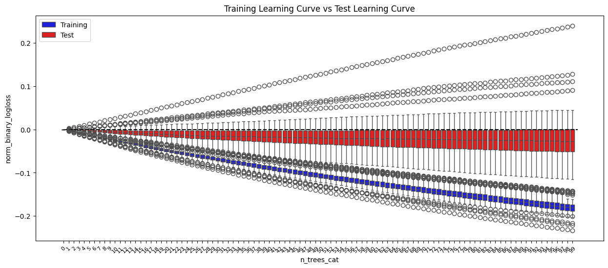
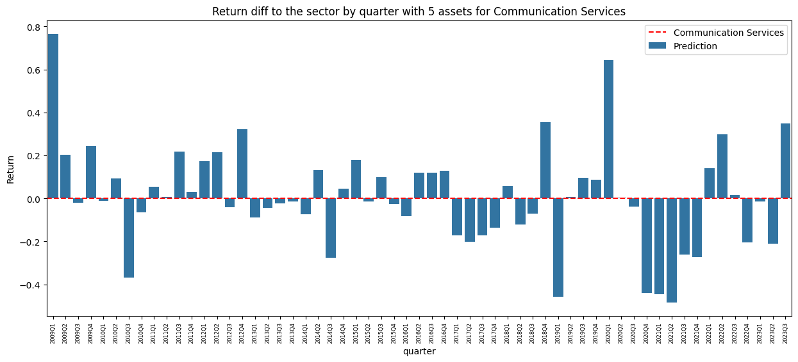

```python
import pandas as pd
import numpy as np
import matplotlib.pyplot as plt
import seaborn as sns
from typing import Tuple

from sklearn.inspection import permutation_importance
import lightgbm as lgb

from utils.functions import calculate_mean_performance_sector, prepare_train_test_data, return_learning_curve, create_results_df, equitative_return, acumulative_year_earnings
```


```python
df_final = pd.read_feather("./data/final_data.feather")
```

### Creation of the Baseline
The baseline is created to have a reference to compare the performance of the model. The baseline is created by using the n_aseets(the baseline will use the same n assets that us), that performed the best in the last year. The baseline will be the average of the returns of the n_assets.


```python
df_final['1year_price_variation'] = (df_final['1year_price'] - df_final['price']) / df_final['price']
df_final['Baseline'] = df_final.groupby('asset_num')['1year_price_variation'].shift(4)
```


```python
def calculate_sp500_return() -> float:
    sp500 = pd.read_csv("./data/initial_data/SP500_TR.csv")
    sp500['date'] = pd.to_datetime(sp500['date']).dt.to_period('Q')
    sp500 = sp500.groupby('date').apply(lambda group: group.loc[group['date'].idxmax()]).reset_index(drop=True)
    sp500['1year_sp500_return'] = (sp500['SP500'].shift(-4) - sp500['SP500']) / sp500['SP500']
    sp500 = sp500[sp500['date'] < '2023Q4']
    return sp500[['date', '1year_sp500_return']]

sp500 = calculate_sp500_return()
sp500.head()
```

    C:\Users\ALEX\AppData\Local\Temp\ipykernel_6844\2621213675.py:4: DeprecationWarning: DataFrameGroupBy.apply operated on the grouping columns. This behavior is deprecated, and in a future version of pandas the grouping columns will be excluded from the operation. Either pass `include_groups=False` to exclude the groupings or explicitly select the grouping columns after groupby to silence this warning.
      sp500 = sp500.groupby('date').apply(lambda group: group.loc[group['date'].idxmax()]).reset_index(drop=True)
    


<div>
<style scoped>
    .dataframe tbody tr th:only-of-type {
        vertical-align: middle;
    }

    .dataframe tbody tr th {
        vertical-align: top;
    }

    .dataframe thead th {
        text-align: right;
    }
</style>
<table border="1" class="dataframe">
  <thead>
    <tr style="text-align: right;">
      <th></th>
      <th>date</th>
      <th>1year_sp500_return</th>
    </tr>
  </thead>
  <tbody>
    <tr>
      <th>0</th>
      <td>2005Q1</td>
      <td>0.057696</td>
    </tr>
    <tr>
      <th>1</th>
      <td>2005Q2</td>
      <td>0.127167</td>
    </tr>
    <tr>
      <th>2</th>
      <td>2005Q3</td>
      <td>0.091986</td>
    </tr>
    <tr>
      <th>3</th>
      <td>2005Q4</td>
      <td>0.106072</td>
    </tr>
    <tr>
      <th>4</th>
      <td>2006Q1</td>
      <td>0.157942</td>
    </tr>
  </tbody>
</table>
</div>


```python
df_final = df_final.merge(sp500, left_on='quarter', right_on='date', how='left').drop(columns='date')
df_final['asset_return_diff_sp500'] = df_final['1year_price_variation'] - df_final['1year_sp500_return']
df_final['asset_return_gt_sp500'] = df_final['asset_return_diff_sp500'] > 0
```

### Creation of more features
Creating new features related to the EV or other features and deleting original ones, p.e.: ebit, ebitda, net income, revenue.
That's because we though fundamental features without any transformation couldn't be comparable between companies of different sizes.


```python
df_final['EV_EBITDA'] = df_final['ev'] / df_final['ebitda']
df_final['EV_EBIT'] = df_final['ev'] / df_final['ebit']
df_final['P_B_ratio'] = df_final['price'] / (df_final['T_assets'] - df_final['T_debt'])

df_final['Debt_to_Equity'] = df_final['T_debt'] / (df_final['T_assets'] - df_final['T_debt'])
df_final['Net_Debt_to_EBITDA'] = df_final['net_debt'] / df_final['ebitda']

df_final['Asset_Turnover'] = df_final['T_rev'] / df_final['T_assets']
df_final['Cash_Conversion_Ratio'] = df_final['cash'] / df_final['T_rev']
```

We also decided to create new features related to the sector of each company, with that we can see the performance of the company in relation to the sector.


```python
sector_performance_cols = ['EV_EBITDA', 'EV_EBIT', 'P_B_ratio', 'Debt_to_Equity', 'Net_Debt_to_EBITDA', 'Asset_Turnover', 'Cash_Conversion_Ratio']
```


```python
df_final = calculate_mean_performance_sector(df_final, sector_performance_cols)
```


```python
df_final.columns
```


    Index(['quarter', 'asset_num', 'price', 'cap_ex', 'cash', 'dil_shares', 'ebit',
           'ebitda', 'net_inc', 'survivor', 'T_assets', 'T_debt', 'T_rev',
           'sector', '1year_price', 'new_sector', 'ebit_marg', 'ebitda_marg',
           'net_marg', 'ROA', 'ROE', 'debts_assets', 'net_debt', 'cash_ratio',
           'net_income_per_share', 'price_earning_ratio', 'ev',
           '1year_price_variation', 'Baseline', '1year_sp500_return',
           'asset_return_diff_sp500', 'asset_return_gt_sp500', 'EV_EBITDA',
           'EV_EBIT', 'P_B_ratio', 'Debt_to_Equity', 'Net_Debt_to_EBITDA',
           'Asset_Turnover', 'Cash_Conversion_Ratio', 'EV_EBITDA_mean_sector_diff',
           'EV_EBIT_mean_sector_diff', 'P_B_ratio_mean_sector_diff',
           'Debt_to_Equity_mean_sector_diff',
           'Net_Debt_to_EBITDA_mean_sector_diff',
           'Asset_Turnover_mean_sector_diff',
           'Cash_Conversion_Ratio_mean_sector_diff'],
          dtype='object')


```python
basic_features = ['cap_ex', 'cash', 'ebit', 'ebitda', 'net_inc', 'T_assets', 'T_debt', 'T_rev','dil_shares','net_debt','ev']
df_final = df_final.drop(columns=basic_features, errors='ignore')

# Handle missing or infinite values
df_final.replace([np.inf, -np.inf], np.nan, inplace=True)
```


```python
info_cols = ['asset_num','quarter','sector','survivor','price','1year_price','prices_std','1year_price_variation','1year_sp500_return','asset_return_diff_sp500']
target_col = 'asset_return_gt_sp500'
df_final['new_sector'] = df_final['new_sector'].astype('category')

feature_cols = [col for col in df_final.columns if col not in info_cols + [target_col]]
print(df_final[feature_cols].isna().sum())
```

    new_sector                                   0
    ebit_marg                                 2741
    ebitda_marg                               2796
    net_marg                                   387
    ROA                                        405
    ROE                                        405
    debts_assets                               396
    cash_ratio                                1673
    net_income_per_share                       564
    price_earning_ratio                        565
    Baseline                                  3455
    EV_EBITDA                                 3007
    EV_EBIT                                   2954
    P_B_ratio                                  396
    Debt_to_Equity                             396
    Net_Debt_to_EBITDA                        2846
    Asset_Turnover                             405
    Cash_Conversion_Ratio                      440
    EV_EBITDA_mean_sector_diff                3007
    EV_EBIT_mean_sector_diff                  2954
    P_B_ratio_mean_sector_diff                 396
    Debt_to_Equity_mean_sector_diff            396
    Net_Debt_to_EBITDA_mean_sector_diff       2846
    Asset_Turnover_mean_sector_diff            405
    Cash_Conversion_Ratio_mean_sector_diff     440
    dtype: int64
    

### Creation of the dataset partitions to train the model


```python
df_final['quarter'] = df_final['quarter'].astype('str')
df_final = df_final[~df_final['quarter'].isin(['2005Q1','2005Q2','2005Q3','2005Q4'])]
```


```python
unique_quarters = df_final['quarter'].astype('str').unique()
unique_quarters
```


    array(['2006Q1', '2006Q2', '2006Q3', '2006Q4', '2007Q1', '2007Q2',
           '2007Q3', '2007Q4', '2008Q1', '2008Q2', '2008Q3', '2008Q4',
           '2009Q1', '2009Q2', '2009Q3', '2009Q4', '2010Q1', '2010Q2',
           '2010Q3', '2010Q4', '2011Q1', '2011Q2', '2011Q3', '2011Q4',
           '2012Q1', '2012Q2', '2012Q3', '2012Q4', '2013Q1', '2013Q2',
           '2013Q3', '2013Q4', '2014Q1', '2014Q2', '2014Q3', '2014Q4',
           '2015Q1', '2015Q2', '2015Q3', '2015Q4', '2016Q1', '2016Q2',
           '2016Q3', '2016Q4', '2017Q1', '2017Q2', '2017Q3', '2017Q4',
           '2018Q1', '2018Q2', '2018Q3', '2018Q4', '2019Q1', '2019Q2',
           '2019Q3', '2019Q4', '2020Q1', '2020Q2', '2020Q3', '2020Q4',
           '2021Q1', '2021Q2', '2021Q3', '2021Q4', '2022Q1', '2022Q2',
           '2022Q3', '2022Q4', '2023Q1', '2023Q2', '2023Q3'], dtype=object)


```python
window_size = 12
datasets = prepare_train_test_data(df_final, 'quarter', feature_cols, target_col, window_size=window_size)
```

### Searching for the best hyperparameters


```python
# This code is commented to avoid running it by mistake but it is left here to show the results
# for n_estimators in [50, 100]:
#     for learning_rate in [0.01, 0.1]:
#         for num_leaves in [32, 64]:
#             for path_smooth in [0.1, 0.5]:
#                 params_lgb = {
#                     'metric': 'logloss',
#                     'random_state': 1,
#                     'verbose': 0,
#                     'n_estimators': n_estimators,
#                     'learning_rate': learning_rate,
#                     'num_leaves': num_leaves,
#                     'path_smooth': path_smooth
#                 }
                
#                 models_list = {}
#                 results_list = {}
#                 predictions_list = {}
#                 compute_importance = True
#                 permut_importances_list = {}
#                 categorical_features = ['new_sector']

#                 for i in range(len(datasets)):
#                     test_quarter = unique_quarters[i + window_size]
#                     #print(f"Training model to test quarter: {test_quarter}")

#                     X_train, y_train, X_test, y_test = datasets[unique_quarters[i+window_size]]

#                     eval_result = {}

#                     model = lgb.LGBMClassifier(**params_lgb)

#                     model.fit(
#                         X_train, y_train,
#                         categorical_feature=categorical_features,
#                         eval_set=[(X_test, y_test), (X_train, y_train)],
#                         eval_metric='logloss',
#                         callbacks=[lgb.record_evaluation(eval_result=eval_result)]
#                     )
                    
#                     results_list[(test_quarter)] = eval_result


#                 test_lc = return_learning_curve(results_list,"valid_0")
#                 train_lc = return_learning_curve(results_list,"training")

#                 train_lc['n_trees_cat'] = pd.Categorical(train_lc['n_trees'], categories=sorted(train_lc['n_trees'].unique()))
#                 test_lc['n_trees_cat'] = pd.Categorical(test_lc['n_trees'], categories=sorted(test_lc['n_trees'].unique()))


#                 fig, (ax1, ax2) = plt.subplots(1, 2, figsize=(11, 6))

#                 sns.boxplot(data=train_lc, x='n_trees_cat', y='norm_binary_logloss', color='blue', ax=ax1)
#                 ax1.hlines(0, 0, len(train_lc['n_trees'].unique()), color='red', linestyle='--')
#                 ax1.set_xticklabels(ax1.get_xticklabels(), rotation=45, fontsize=8)
#                 ax1.set_title('Training Learning Curve')

#                 sns.boxplot(data=test_lc, x='n_trees_cat', y='norm_binary_logloss', color='blue', ax=ax2)
#                 ax2.hlines(0, 0, len(test_lc['n_trees'].unique()), color='red', linestyle='--')
#                 ax2.set_xticklabels(ax2.get_xticklabels(), rotation=45, fontsize=8)
#                 ax2.set_title('Test Learning Curve')

#                 plt.suptitle(f'Learning Curves with n_est={n_estimators},lr={learning_rate},n_leaves={num_leaves},path={path_smooth}', fontsize=16, y=1.02)

#                 plt.tight_layout()  
#                 plt.show()
```

After comparing the learning curves, we choose the model with Lr = 0.01, n_leaves = 64, path_smooth = 0.1 or 0.5, and n_estimators = 100.


```python
params_lgb = {
    'objective': 'binary',
    'metric': 'logloss',
    'random_state': 1,
    'verbose': 0,
    'n_estimators': 100,
    'learning_rate': 0.01,
    'num_leaves': 64,
    'path_smooth': 0.5
}


models_list = {}
results_list = {}
predictions_list = {}
compute_importance = True
permut_importances_list = {}
categorical_features = ['new_sector']

for i in range(len(datasets)):
    test_quarter = unique_quarters[i + window_size]
    print(f"Training model to test quarter: {test_quarter}")
    
    X_train, y_train, X_test, y_test = datasets[unique_quarters[i+window_size]]
    
    eval_result = {}
    
    model = lgb.LGBMClassifier(**params_lgb)
    
    model.fit(
        X_train, y_train,
        categorical_feature=categorical_features,
        eval_set=[(X_test, y_test), (X_train, y_train)],
        eval_metric='logloss',
        callbacks=[lgb.record_evaluation(eval_result=eval_result)]
    )
    
    if compute_importance:
        r = permutation_importance(model, X_test, y_test, n_repeats=15, random_state=0)
        feature_names = X_test.columns
        df_permutation_importance = pd.DataFrame({'importance': r.importances_mean, 'feature': feature_names})
    else:
        df_permutation_importance = pd.DataFrame()
    
    
    models_list[(test_quarter)] = model
    results_list[(test_quarter)] = eval_result
    predictions_list[(test_quarter)] = model.predict_proba(X_test)[:,1]
    permut_importances_list[(test_quarter)] = df_permutation_importance
```

    Training model to test quarter: 2009Q1
    Training model to test quarter: 2009Q2
    Training model to test quarter: 2009Q3
    Training model to test quarter: 2009Q4
    Training model to test quarter: 2010Q1
    Training model to test quarter: 2010Q2
    Training model to test quarter: 2010Q3
    Training model to test quarter: 2010Q4
    Training model to test quarter: 2011Q1
    Training model to test quarter: 2011Q2
    Training model to test quarter: 2011Q3
    Training model to test quarter: 2011Q4
    Training model to test quarter: 2012Q1
    Training model to test quarter: 2012Q2
    Training model to test quarter: 2012Q3
    Training model to test quarter: 2012Q4
    Training model to test quarter: 2013Q1
    Training model to test quarter: 2013Q2
    Training model to test quarter: 2013Q3
    Training model to test quarter: 2013Q4
    Training model to test quarter: 2014Q1
    Training model to test quarter: 2014Q2
    Training model to test quarter: 2014Q3
    Training model to test quarter: 2014Q4
    Training model to test quarter: 2015Q1
    Training model to test quarter: 2015Q2
    Training model to test quarter: 2015Q3
    Training model to test quarter: 2015Q4
    Training model to test quarter: 2016Q1
    Training model to test quarter: 2016Q2
    Training model to test quarter: 2016Q3
    Training model to test quarter: 2016Q4
    Training model to test quarter: 2017Q1
    Training model to test quarter: 2017Q2
    Training model to test quarter: 2017Q3
    Training model to test quarter: 2017Q4
    Training model to test quarter: 2018Q1
    Training model to test quarter: 2018Q2
    Training model to test quarter: 2018Q3
    Training model to test quarter: 2018Q4
    Training model to test quarter: 2019Q1
    Training model to test quarter: 2019Q2
    Training model to test quarter: 2019Q3
    Training model to test quarter: 2019Q4
    Training model to test quarter: 2020Q1
    Training model to test quarter: 2020Q2
    Training model to test quarter: 2020Q3
    Training model to test quarter: 2020Q4
    Training model to test quarter: 2021Q1
    Training model to test quarter: 2021Q2
    Training model to test quarter: 2021Q3
    Training model to test quarter: 2021Q4
    Training model to test quarter: 2022Q1
    Training model to test quarter: 2022Q2
    Training model to test quarter: 2022Q3
    Training model to test quarter: 2022Q4
    Training model to test quarter: 2023Q1
    Training model to test quarter: 2023Q2
    Training model to test quarter: 2023Q3
    


```python
test_lc = return_learning_curve(results_list,"valid_0")
train_lc = return_learning_curve(results_list,"training")

train_lc['n_trees_cat'] = pd.Categorical(train_lc['n_trees'], categories=sorted(train_lc['n_trees'].unique()))
test_lc['n_trees_cat'] = pd.Categorical(test_lc['n_trees'], categories=sorted(test_lc['n_trees'].unique()))
```


```python
plt.subplots(figsize=(15, 6))
sns.boxplot(data=train_lc, x='n_trees_cat', y='norm_binary_logloss', color='blue')
plt.hlines(0, 0, len(test_lc['n_trees'].unique()), color='red', linestyle='--')
plt.xticks(rotation=45, fontsize=8)
plt.title('Training Learning Curve')
plt.show()
```


    

    


```python
plt.subplots(figsize=(15, 6))
sns.boxplot(data=test_lc, x='n_trees_cat', y='norm_binary_logloss', color='blue')
plt.hlines(0, 0, len(test_lc['n_trees'].unique()), color='red', linestyle='--')
plt.xticks(rotation=45, fontsize=8)
plt.title('Test Learning Curve')
plt.show()
```


    

    


```python
plt.subplots(figsize=(15, 6))
sns.boxplot(data=train_lc, x='n_trees_cat', y='norm_binary_logloss', color='blue', label='Training')
sns.boxplot(data=test_lc, x='n_trees_cat', y='norm_binary_logloss', color='red', label='Test')
plt.hlines(0, 0, len(test_lc['n_trees'].unique()), color='black', linestyle='--')
plt.xticks(rotation=45, fontsize=8)
plt.title('Training Learning Curve vs Test Learning Curve')
plt.legend()
plt.show()
```


    

    


```python
importance_dfs = []

# Generate a DataFrame for each quarter with the permutation importances
for quarter, df_imp in permut_importances_list.items():
    df_imp['quarter'] = quarter
    df_imp['importance'] = df_imp['importance']
    importance_dfs.append(df_imp)

df_importances = pd.concat(importance_dfs, ignore_index=True)

df_importances
```


<div>
<style scoped>
    .dataframe tbody tr th:only-of-type {
        vertical-align: middle;
    }

    .dataframe tbody tr th {
        vertical-align: top;
    }

    .dataframe thead th {
        text-align: right;
    }
</style>
<table border="1" class="dataframe">
  <thead>
    <tr style="text-align: right;">
      <th></th>
      <th>importance</th>
      <th>feature</th>
      <th>quarter</th>
    </tr>
  </thead>
  <tbody>
    <tr>
      <th>0</th>
      <td>-6.612686e-03</td>
      <td>new_sector</td>
      <td>2009Q1</td>
    </tr>
    <tr>
      <th>1</th>
      <td>-1.349528e-03</td>
      <td>ebit_marg</td>
      <td>2009Q1</td>
    </tr>
    <tr>
      <th>2</th>
      <td>3.700743e-17</td>
      <td>ebitda_marg</td>
      <td>2009Q1</td>
    </tr>
    <tr>
      <th>3</th>
      <td>-2.699055e-04</td>
      <td>net_marg</td>
      <td>2009Q1</td>
    </tr>
    <tr>
      <th>4</th>
      <td>-2.699055e-04</td>
      <td>ROA</td>
      <td>2009Q1</td>
    </tr>
    <tr>
      <th>...</th>
      <td>...</td>
      <td>...</td>
      <td>...</td>
    </tr>
    <tr>
      <th>1470</th>
      <td>8.333333e-03</td>
      <td>P_B_ratio_mean_sector_diff</td>
      <td>2023Q3</td>
    </tr>
    <tr>
      <th>1471</th>
      <td>8.736559e-03</td>
      <td>Debt_to_Equity_mean_sector_diff</td>
      <td>2023Q3</td>
    </tr>
    <tr>
      <th>1472</th>
      <td>3.360215e-03</td>
      <td>Net_Debt_to_EBITDA_mean_sector_diff</td>
      <td>2023Q3</td>
    </tr>
    <tr>
      <th>1473</th>
      <td>2.220446e-17</td>
      <td>Asset_Turnover_mean_sector_diff</td>
      <td>2023Q3</td>
    </tr>
    <tr>
      <th>1474</th>
      <td>2.419355e-03</td>
      <td>Cash_Conversion_Ratio_mean_sector_diff</td>
      <td>2023Q3</td>
    </tr>
  </tbody>
</table>
<p>1475 rows × 3 columns</p>
</div>


```python
df_importances_mean = df_importances.groupby('feature')['importance'].mean().sort_values(ascending=False)
sns.barplot(x=df_importances_mean, y=df_importances_mean.index)
plt.xlabel('Importance')
plt.ylabel('Feature')
plt.title('Mean Feature Importance')
plt.show()
```


    

    


```python
df_importances_sorted = df_importances.sort_values(by=['quarter','importance'], ascending=[True,False]).reset_index(drop=True)
df_importances_sorted["rank"] = df_importances_sorted.groupby(["quarter"]).cumcount()
r_all_permutation_importances = df_importances_sorted[df_importances_sorted["rank"]<3]
```


```python
pivot_df = r_all_permutation_importances.pivot(index="quarter", columns="feature", values="importance")

pivot_df.plot(
    kind="bar",
    stacked=True,
    figsize=(12, 8),
)
plt.xlabel("Quarter")
plt.ylabel("Importance")
plt.title("Feature Importance by Quarter")
plt.legend(title="Feature", bbox_to_anchor=(1.05, 1), loc='upper left')
plt.tight_layout()
plt.show()
```


    

    


### Comparing predictions with SP500


```python
def calculate_returns(sector_df:bool=False,n_assets:int = 20,column:str='asset_return_diff_sp500') -> pd.DataFrame:
    prediction_returns = []
    baseline_returns = []
    sector_returns = []
    sector_list = []
    quarter_list = []
    for i in range(len(datasets)):
        quarter = unique_quarters[i+window_size] 
        if sector_df:
            df = create_results_df(df_final,predictions_list, quarter,True,column)
            for sector in df['new_sector'].unique():
                df_sector = df[df['new_sector'] == sector]
                return_sector = df_sector[column].mean()
                sector_returns.append(return_sector)
                sector_list.append(sector)
                return_prediction_equitative = equitative_return(df_sector, n_assets,column=column)
                prediction_returns.append(return_prediction_equitative)
                return_baseline = df_sector.sort_values('Baseline', ascending=False).head(n_assets)[column].mean()
                baseline_returns.append(return_baseline)
                
                quarter_list.append(quarter)
        else:
            df = create_results_df(df_final,predictions_list, quarter,False,column)
            return_prediction_equitative = equitative_return(df, n_assets,column)
            return_baseline = df.sort_values('Baseline', ascending=False).head(n_assets)[column].mean()
            prediction_returns.append(return_prediction_equitative)
            baseline_returns.append(return_baseline)
    
    if sector_df:
        return pd.DataFrame({'quarter': quarter_list, 'sector': sector_list,
                         'prediction_return': prediction_returns,  
                         'baseline_return': baseline_returns, 'sector_return': sector_returns})
    else: 
        return pd.DataFrame({'quarter': unique_quarters[window_size:], 
                         'prediction_return': prediction_returns,  
                         'baseline_return': baseline_returns})
```

### Returns per quarter prediction vs SP500
At the graph, we can see for each quarter the difference between the return of the prediction and the return of the SP500. We take also the difference between Baseline and SP500 to compare with the prediction model.


```python
n_assets = 20
df_returns_quarters = calculate_returns(n_assets=n_assets,column = "asset_return_diff_sp500")
df_returns_quarters['Q'] = df_returns_quarters['quarter'].str[4:]
```


```python
plt.subplots(figsize=(15, 6))
sns.barplot(data=df_returns_quarters, x='quarter', y='prediction_return',hue = 'Q')
plt.axhline(y=0.0, color='r', linestyle='--', label='SP500')
plt.title(f'Return diff of the prediction to SP500 by quarter with {n_assets} assets coloured by each quarter')
plt.ylabel('Return (%)')
plt.xticks(rotation=90, fontsize=6)
plt.legend()
plt.show()
```


    

    


Percentage of returns of the predictions that performed better than the SP500: 


```python
(df_returns_quarters['prediction_return'] > 0).mean()
```


    0.4576271186440678


### Comparing predictions versus the return of the market for each sector

For each quarter, and sector, we will calculate the return of the model for the top 20 assets compared to the return of the sector


```python
n_assets = 5
sector_returns = calculate_returns(sector_df=True,n_assets=n_assets,column='asset_return_diff_sp500')
```


```python
for sector in sector_returns['sector'].unique():
    df_sector = sector_returns[sector_returns['sector'] == sector]
    plt.subplots(figsize=(15, 6))
    sns.barplot(data=df_sector, x='quarter', y='prediction_return',label='Prediction')
    plt.axhline(y=0.0, color='r', linestyle='--', label=sector)
    plt.title(f'Return diff to the sector by quarter with {n_assets} assets for {sector}')
    plt.ylabel('Return')
    plt.xticks(rotation=90, fontsize=6)
    plt.legend()
    plt.show()
```


    

    


    

    


    

    


    

    


    

    


    

    


    

    


    

    


    

    


    

    


    

    


### Performance with 20 assets


```python
n_assets = 20
sp500['date'] = sp500['date'].astype(str)
df_returns_quarters = calculate_returns(n_assets=n_assets,
                                        column='1year_price_variation').merge(sp500,
                                                                              left_on='quarter', 
                                                                              right_on='date', how='left').drop(columns='date')
```


```python
(df_returns_quarters['prediction_return'] > df_returns_quarters['1year_sp500_return']).mean()
```


    0.4576271186440678


```python
df_returns_quarters['prediction_return'].mean()
```


    0.15158401233048271


```python
df_returns_quarters['baseline_return'].mean()
```


    0.15697153159535443


```python
df_returns_quarters['1year_sp500_return'].mean()
```


    0.1525483773289356


```python
plt.figure(figsize=(15, 6))
sns.lineplot(data=df_returns_quarters, x=df_returns_quarters.index, y='prediction_return',label='Prediction')
sns.lineplot(data=df_returns_quarters, x=df_returns_quarters.index, y='baseline_return',label='Baseline')
sns.lineplot(data=df_returns_quarters, x=df_returns_quarters.index, y='1year_sp500_return',label='SP500')
plt.title('Return by year')
plt.xticks(rotation=90, fontsize=6)
plt.xlabel('Quarter')
plt.ylabel('Return per quarter')
plt.show()
```


    

    


```python
import matplotlib.pyplot as plt
import seaborn as sns
import pandas as pd


df_melted = df_returns_quarters.melt(id_vars=['quarter'], 
                                     value_vars=['prediction_return', 'baseline_return', '1year_sp500_return'],
                                     var_name='Category', 
                                     value_name='Return')

plt.figure(figsize=(12, 6))
sns.barplot(data=df_melted, x='quarter', y='Return', hue='Category', palette='muted')

plt.title('Comparative of return by quarter', fontsize=14)
plt.xlabel('Quarter', fontsize=12)
plt.ylabel('Return (%)', fontsize=12)
plt.xticks(rotation=90, fontsize=10)
plt.show()

```


    

    


```python
acumulative_year = acumulative_year_earnings(df_returns_quarters)
```


```python
plt.figure(figsize=(15, 6))
sns.lineplot(data=acumulative_year, x=acumulative_year.index, y='cumulative_return_prediction_return',label='Prediction')
sns.lineplot(data=acumulative_year, x=acumulative_year.index, y='cumulative_return_baseline_return',label='Baseline')
sns.lineplot(data=acumulative_year, x=acumulative_year.index, y='cumulative_return_1year_sp500_return',label='SP500')
plt.title('Cumulative return by year')
plt.xticks(rotation=90, fontsize=6)
plt.xlabel('Year')
plt.ylabel('Acumulative return')
plt.show()
```


    

    


```python
acumulative_year.iloc[-1]
```


    cumulative_return_prediction_return     606.766827
    cumulative_return_baseline_return       531.605529
    cumulative_return_1year_sp500_return    592.642963
    Name: 2024, dtype: float64


```python
### CAGR
cagr = lambda x: (x.iloc[-1] / x.iloc[0]) ** (1 / len(x)) - 1
cagr(acumulative_year)*100
```


    cumulative_return_prediction_return     11.928031
    cumulative_return_baseline_return       11.006739
    cumulative_return_1year_sp500_return    11.763391
    dtype: float64


```python
(acumulative_year['cumulative_return_prediction_return'] > acumulative_year['cumulative_return_1year_sp500_return']).mean()
```


    0.75


```python
(acumulative_year['cumulative_return_baseline_return'] > acumulative_year['cumulative_return_1year_sp500_return']).mean()
```


    0.125


### Performance with 10 assets


```python
n_assets = 10
sp500['date'] = sp500['date'].astype(str)
df_returns_quarters = calculate_returns(n_assets=n_assets,
                                        column='1year_price_variation').merge(sp500,
                                                                              left_on='quarter', 
                                                                              right_on='date', how='left').drop(columns='date')

```


```python
(df_returns_quarters['prediction_return'] > df_returns_quarters['1year_sp500_return']).mean()
```


    0.4576271186440678


```python
df_returns_quarters['prediction_return'].mean()
```


    0.1635182141133435


```python
df_returns_quarters['baseline_return'].mean()
```


    0.1757059811093407


```python
df_returns_quarters['1year_sp500_return'].mean()
```


    0.1525483773289356


```python
acumulative_year = acumulative_year_earnings(df_returns_quarters)
```


```python
plt.figure(figsize=(15, 6))
sns.lineplot(data=acumulative_year, x=acumulative_year.index, y='cumulative_return_prediction_return',label='Prediction')
sns.lineplot(data=acumulative_year, x=acumulative_year.index, y='cumulative_return_baseline_return',label='Baseline')
sns.lineplot(data=acumulative_year, x=acumulative_year.index, y='cumulative_return_1year_sp500_return',label='SP500')
plt.title('Cumulative return by year')
plt.xticks(rotation=90, fontsize=6)
plt.xlabel('Year')
plt.ylabel('Acumulative return')
plt.show()
```


    

    


```python
acumulative_year.iloc[-1]
```


    cumulative_return_prediction_return     688.204850
    cumulative_return_baseline_return       641.672696
    cumulative_return_1year_sp500_return    592.642963
    Name: 2024, dtype: float64


```python
### CAGR
cagr = lambda x: (x.iloc[-1] / x.iloc[0]) ** (1 / len(x)) - 1
cagr(acumulative_year)*100
```


    cumulative_return_prediction_return     12.812535
    cumulative_return_baseline_return       12.320001
    cumulative_return_1year_sp500_return    11.763391
    dtype: float64


```python
(acumulative_year['cumulative_return_prediction_return'] > acumulative_year['cumulative_return_1year_sp500_return']).mean()
```


    0.8125


```python
(acumulative_year['cumulative_return_baseline_return'] > acumulative_year['cumulative_return_1year_sp500_return']).mean()
```


    0.3125


### Performance with 5 assets


```python
n_assets = 5
sp500['date'] = sp500['date'].astype(str)
df_returns_quarters = calculate_returns(n_assets=n_assets,
                                        column='1year_price_variation').merge(sp500,
                                                                              left_on='quarter', 
                                                                              right_on='date', how='left').drop(columns='date')

```


```python
(df_returns_quarters['prediction_return'] > df_returns_quarters['1year_sp500_return']).mean()
```


    0.4915254237288136


```python
df_returns_quarters['prediction_return'].mean()
```


    0.1747418881892653


```python
df_returns_quarters['baseline_return'].mean()
```


    0.22120015662961945


```python
df_returns_quarters['1year_sp500_return'].mean()
```


    0.1525483773289356


```python
acumulative_year = acumulative_year_earnings(df_returns_quarters)
```


```python
plt.figure(figsize=(15, 6))
sns.lineplot(data=acumulative_year, x=acumulative_year.index, y='cumulative_return_prediction_return',label='Prediction')
sns.lineplot(data=acumulative_year, x=acumulative_year.index, y='cumulative_return_baseline_return',label='Baseline')
sns.lineplot(data=acumulative_year, x=acumulative_year.index, y='cumulative_return_1year_sp500_return',label='SP500')
plt.title('Cumulative return by year')
plt.xticks(rotation=90, fontsize=6)
plt.xlabel('Year')
plt.ylabel('Acumulative return')
plt.show()
```


    

    


```python
acumulative_year.iloc[-1]
```


    cumulative_return_prediction_return     779.249593
    cumulative_return_baseline_return       926.437480
    cumulative_return_1year_sp500_return    592.642963
    Name: 2024, dtype: float64


```python
### CAGR
cagr = lambda x: (x.iloc[-1] / x.iloc[0]) ** (1 / len(x)) - 1
cagr(acumulative_year)*100
```


    cumulative_return_prediction_return     13.691969
    cumulative_return_baseline_return       14.928042
    cumulative_return_1year_sp500_return    11.763391
    dtype: float64


```python
(acumulative_year['cumulative_return_prediction_return'] > acumulative_year['cumulative_return_1year_sp500_return']).mean()
```


    0.875


```python
(acumulative_year['cumulative_return_baseline_return'] > acumulative_year['cumulative_return_1year_sp500_return']).mean()
```


    0.5


### Return depending on the year the porfolio was created


```python
n_assets =  10
df_returns_quarters = calculate_returns(n_assets=n_assets,
                                        column='1year_price_variation').merge(sp500,
                                                                              left_on='quarter', 
                                                                              right_on='date', how='left').drop(columns='date')
```


```python
unique_years = df_returns_quarters['quarter'].str[:4].unique()

for i, year in enumerate(unique_years):
    # Filtrar el DataFrame eliminando los años anteriores al año actual en la iteración
    remaining_years = unique_years[i:]  # Toma los años desde la posición actual hasta el final
    filtered_df = df_returns_quarters[df_returns_quarters['quarter'].str[:4].isin(remaining_years)]
    
    # Calcular los retornos acumulativos con el DataFrame filtrado
    acumulative_year = acumulative_year_earnings(filtered_df)
    
    # Crear el gráfico
    plt.figure(figsize=(15, 6))
    sns.lineplot(data=acumulative_year, x=acumulative_year.index, y='cumulative_return_prediction_return', label='Prediction')
    sns.lineplot(data=acumulative_year, x=acumulative_year.index, y='cumulative_return_baseline_return', label='Baseline')
    sns.lineplot(data=acumulative_year, x=acumulative_year.index, y='cumulative_return_1year_sp500_return', label='SP500')
    
    # Personalización del gráfico
    plt.title(f'Cumulative return by quarter starting from {year}')
    plt.xticks(rotation=90, fontsize=6)
    plt.xlabel('Quarter')
    plt.ylabel('Cumulative Return')
    plt.legend()
    plt.tight_layout()
    plt.show()
    
    print(f"Year: {year}")
    print(cagr(acumulative_year)*100)
    print(f"Prediction > SP500: {(acumulative_year['cumulative_return_prediction_return'] > acumulative_year['cumulative_return_1year_sp500_return']).mean()}")
    print(f"Baseline > SP500: {(acumulative_year['cumulative_return_baseline_return'] > acumulative_year['cumulative_return_1year_sp500_return']).mean()}")
    print("")
    
```


    

    


    Year: 2009
    cumulative_return_prediction_return     12.812535
    cumulative_return_baseline_return       12.320001
    cumulative_return_1year_sp500_return    11.763391
    dtype: float64
    Prediction > SP500: 0.8125
    Baseline > SP500: 0.3125
    
    


    

    


    Year: 2010
    cumulative_return_prediction_return     10.989461
    cumulative_return_baseline_return       11.747783
    cumulative_return_1year_sp500_return    10.727079
    dtype: float64
    Prediction > SP500: 0.3333333333333333
    Baseline > SP500: 0.4
    
    


    

    


    Year: 2011
    cumulative_return_prediction_return     10.167478
    cumulative_return_baseline_return       12.378543
    cumulative_return_1year_sp500_return     9.975597
    dtype: float64
    Prediction > SP500: 0.14285714285714285
    Baseline > SP500: 0.7857142857142857
    
    


    

    


    Year: 2012
    cumulative_return_prediction_return     10.354663
    cumulative_return_baseline_return       12.262733
    cumulative_return_1year_sp500_return    10.399114
    dtype: float64
    Prediction > SP500: 0.15384615384615385
    Baseline > SP500: 0.7692307692307693
    
    


    

    


    Year: 2013
    cumulative_return_prediction_return     10.319498
    cumulative_return_baseline_return       11.973680
    cumulative_return_1year_sp500_return     9.902606
    dtype: float64
    Prediction > SP500: 0.16666666666666666
    Baseline > SP500: 0.6666666666666666
    
    


    

    


    Year: 2014
    cumulative_return_prediction_return      9.350706
    cumulative_return_baseline_return       10.877043
    cumulative_return_1year_sp500_return     8.492446
    dtype: float64
    Prediction > SP500: 0.36363636363636365
    Baseline > SP500: 0.6363636363636364
    
    


    

    


    Year: 2015
    cumulative_return_prediction_return      9.183836
    cumulative_return_baseline_return       12.236269
    cumulative_return_1year_sp500_return     8.268191
    dtype: float64
    Prediction > SP500: 0.5
    Baseline > SP500: 0.9
    
    


    

    


    Year: 2016
    cumulative_return_prediction_return      9.304479
    cumulative_return_baseline_return       13.284727
    cumulative_return_1year_sp500_return     8.917263
    dtype: float64
    Prediction > SP500: 0.2222222222222222
    Baseline > SP500: 0.8888888888888888
    
    


    

    


    Year: 2017
    cumulative_return_prediction_return      8.598475
    cumulative_return_baseline_return       11.452860
    cumulative_return_1year_sp500_return     8.128792
    dtype: float64
    Prediction > SP500: 0.375
    Baseline > SP500: 0.75
    
    


    

    


    Year: 2018
    cumulative_return_prediction_return     8.492237
    cumulative_return_baseline_return       8.834094
    cumulative_return_1year_sp500_return    7.084379
    dtype: float64
    Prediction > SP500: 0.7142857142857143
    Baseline > SP500: 0.7142857142857143
    
    


    

    


    Year: 2019
    cumulative_return_prediction_return      8.802483
    cumulative_return_baseline_return       12.743294
    cumulative_return_1year_sp500_return     7.187042
    dtype: float64
    Prediction > SP500: 0.6666666666666666
    Baseline > SP500: 0.8333333333333334
    
    


    

    


    Year: 2020
    cumulative_return_prediction_return     11.370688
    cumulative_return_baseline_return       14.003766
    cumulative_return_1year_sp500_return     7.372779
    dtype: float64
    Prediction > SP500: 0.8
    Baseline > SP500: 0.8
    
    


    

    


    Year: 2021
    cumulative_return_prediction_return     0.412434
    cumulative_return_baseline_return       7.295425
    cumulative_return_1year_sp500_return    0.162519
    dtype: float64
    Prediction > SP500: 0.5
    Baseline > SP500: 0.75
    
    


    

    


    Year: 2022
    cumulative_return_prediction_return     0.769283
    cumulative_return_baseline_return       4.642198
    cumulative_return_1year_sp500_return   -2.586366
    dtype: float64
    Prediction > SP500: 0.6666666666666666
    Baseline > SP500: 0.3333333333333333
    
    


    

    


    Year: 2023
    cumulative_return_prediction_return    -4.245070
    cumulative_return_baseline_return       6.071261
    cumulative_return_1year_sp500_return   -2.510148
    dtype: float64
    Prediction > SP500: 0.0
    Baseline > SP500: 0.5
    
    

### Insights from the analysis
As we can see, in order to analyze the consistency of our model, it may be better to check the independent returns of each quarter, rather than the cumulative return. That's because the cumulative return may be influenced by the performance of the model in the first quarter, this can be seen on the 2009, where the model seems to have a great consistency, due to the performance of the first year, but in the following years, the performance is similar to SP500. The opposite can be seen on the following years, where the model seems to have a bad consistency, but in the end,the model outperformed the SP500. 

### Performance with 5 assets per sector


```python
n_assets = 5
sector_returns = calculate_returns(sector_df=True,n_assets=n_assets,column='1year_price_variation')
```


```python
for sector in sector_returns['sector'].unique():
    sector_acumulative_year = acumulative_year_earnings(sector_returns[sector_returns['sector'].str.contains(sector)])
    plt.subplots(figsize=(15, 6))
    sns.lineplot(data=sector_acumulative_year, x=sector_acumulative_year.index, y='cumulative_return_prediction_return',label='Prediction')
    sns.lineplot(data=sector_acumulative_year, x=sector_acumulative_year.index, y='cumulative_return_baseline_return',label='Baseline')
    sns.lineplot(data=sector_acumulative_year, x=sector_acumulative_year.index, y='cumulative_return_sector_return',label=sector)
    plt.title(f'Cumulative return for {sector}')
    plt.xticks(rotation=90, fontsize=6)
    plt.xlabel('Year')
    plt.ylabel('Return')
    plt.show()
    
    print(f"Anualized return for {sector}")
    print(cagr(sector_acumulative_year)*100)
```


    

    


    Anualized return for Information Technology
    cumulative_return_prediction_return    13.466433
    cumulative_return_baseline_return      14.894145
    cumulative_return_sector_return        15.825332
    dtype: float64
    


    

    


    Anualized return for Health Care
    cumulative_return_prediction_return    11.342887
    cumulative_return_baseline_return      11.946829
    cumulative_return_sector_return        11.523774
    dtype: float64
    


    

    


    Anualized return for Consumer Discretionary
    cumulative_return_prediction_return    13.749081
    cumulative_return_baseline_return       6.674209
    cumulative_return_sector_return        10.881734
    dtype: float64
    


    

    


    Anualized return for Financials
    cumulative_return_prediction_return    11.455026
    cumulative_return_baseline_return       8.280418
    cumulative_return_sector_return        11.411276
    dtype: float64
    


    

    


    Anualized return for Communication Services
    cumulative_return_prediction_return    10.832259
    cumulative_return_baseline_return       9.881442
    cumulative_return_sector_return        10.626767
    dtype: float64
    


    

    


    Anualized return for Consumer Staples
    cumulative_return_prediction_return    11.233413
    cumulative_return_baseline_return       9.041555
    cumulative_return_sector_return         9.962847
    dtype: float64
    


    

    


    Anualized return for Industrials
    cumulative_return_prediction_return    15.028583
    cumulative_return_baseline_return      13.391614
    cumulative_return_sector_return        12.912353
    dtype: float64
    


    

    


    Anualized return for Materials
    cumulative_return_prediction_return    10.332973
    cumulative_return_baseline_return      10.102104
    cumulative_return_sector_return        10.691435
    dtype: float64
    


    

    


    Anualized return for Utilities
    cumulative_return_prediction_return     9.826274
    cumulative_return_baseline_return      10.491151
    cumulative_return_sector_return         8.695793
    dtype: float64
    


    

    


    Anualized return for Energy
    cumulative_return_prediction_return    3.797180
    cumulative_return_baseline_return      3.729504
    cumulative_return_sector_return        5.318426
    dtype: float64
    


    

    


    Anualized return for Real Estate
    cumulative_return_prediction_return    10.801188
    cumulative_return_baseline_return       7.100299
    cumulative_return_sector_return        10.173296
    dtype: float64
    

### Comparing the proportion of the percentage of the sectors invested in the portfolio (Case with 20 assets)


```python
df_sectors = pd.DataFrame(columns=['quarter','percentage']) 
for i in range(len(datasets)):
    quarter = unique_quarters[i+window_size] 
    df = create_results_df(df_final,predictions_list, quarter,True,'1year_price_variation')
    sectors_invested = df.sort_values('rank_pos', ascending=False).head(20)['new_sector'].value_counts(normalize=True)
    data = {'quarter':quarter,'percentage':sectors_invested}
    df_pivot = pd.DataFrame(data).reset_index()
    df_sectors = pd.concat([df_sectors,df_pivot])
df_sectors = df_sectors.groupby(['quarter','new_sector'])['percentage'].mean().reset_index()
```

    C:\Users\ALEX\AppData\Local\Temp\ipykernel_6844\2485387780.py:9: FutureWarning: The behavior of DataFrame concatenation with empty or all-NA entries is deprecated. In a future version, this will no longer exclude empty or all-NA columns when determining the result dtypes. To retain the old behavior, exclude the relevant entries before the concat operation.
      df_sectors = pd.concat([df_sectors,df_pivot])
    C:\Users\ALEX\AppData\Local\Temp\ipykernel_6844\2485387780.py:10: FutureWarning: The default of observed=False is deprecated and will be changed to True in a future version of pandas. Pass observed=False to retain current behavior or observed=True to adopt the future default and silence this warning.
      df_sectors = df_sectors.groupby(['quarter','new_sector'])['percentage'].mean().reset_index()
    


```python
df_sectors.pivot(index='quarter',columns='new_sector',values='percentage').plot(
        kind="bar",
        stacked=True,
        figsize=(12, 8),)
plt.legend(title="Sector",bbox_to_anchor=(1.05, 1), loc='upper left')
plt.title("Percentage of investment by sector")
plt.xlabel("Quarter")
plt.ylabel("Percentage")
plt.show()
```


    

    

